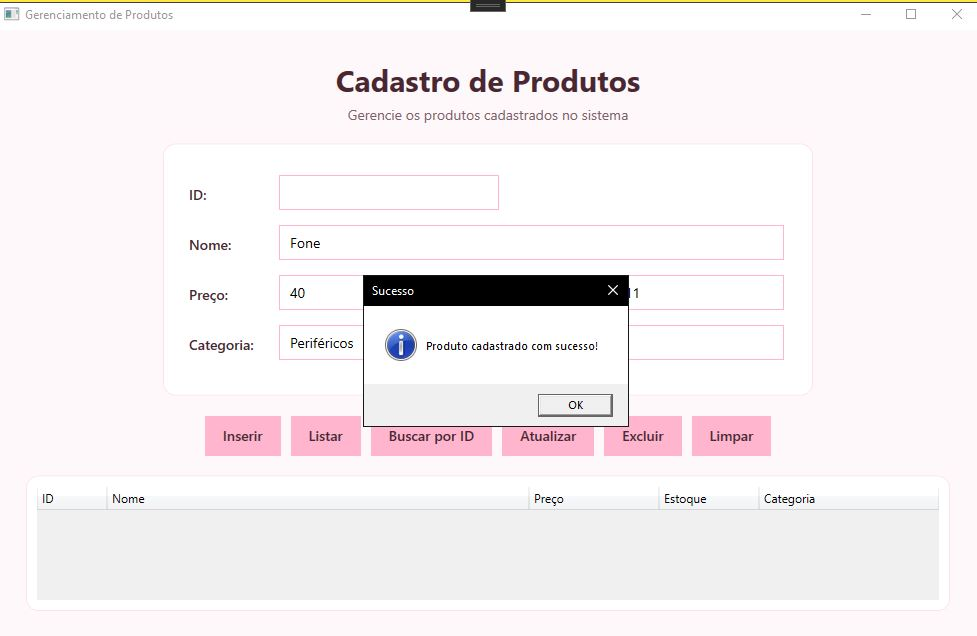
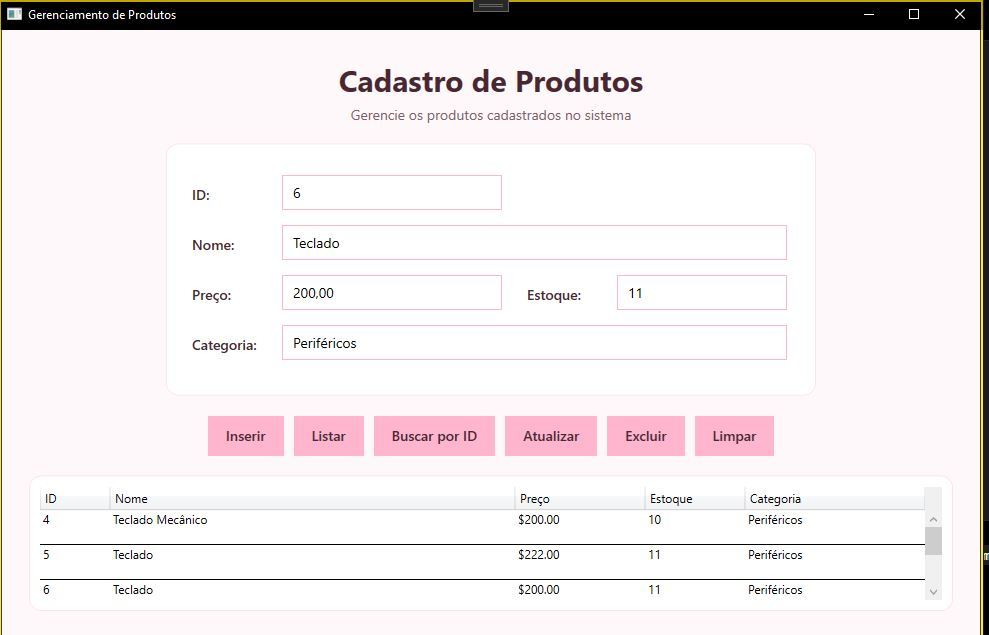
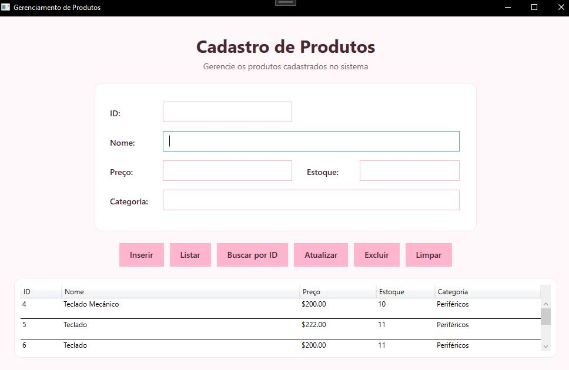

# Checkpoint 05 - CRUD de Produtos com ADO.NET

Projeto desenvolvido para o **Checkpoint 5 de C#**, com o objetivo de criar uma aplicação desktop em **WPF** para cadastro e gerenciamento de produtos, utilizando **ADO.NET** para conexão e persistência dos dados no SQL Server.

## Funcionalidades

A aplicação permite realizar as principais operações de CRUD:

- Inserir produtos;
- Listar todos os produtos cadastrados;
- Buscar produto por ID;
- Atualizar produtos;
- Excluir produtos;
- Limpar os campos da interface;
- Registrar as operações realizadas em arquivo de log.

## Tecnologias utilizadas

- C#
- WPF
- .NET
- ADO.NET
- SQL Server Express
- Microsoft.Data.SqlClient
- Microsoft.Extensions.Configuration.Json

## Estrutura do projeto

```text
Checkpoint05Crud/
├── Database/
│   └── create_database.sql
├── Models/
│   └── Produto.cs
├── Repositories/
│   └── ProdutoRepository.cs
├── Services/
│   └── LogService.cs
├── docs/
│   ├── inserir.png
│   ├── buscar.png
│   └── listar.png
├── App.xaml
├── App.xaml.cs
├── MainWindow.xaml
├── MainWindow.xaml.cs
└── appsettings.json
```

## Banco de dados

O projeto utiliza **SQL Server Express**.

O script necessário para criação do banco de dados e da tabela está disponível em:

```text
Database/create_database.sql
```

A tabela `Produtos` possui os seguintes campos:

| Campo | Tipo |
|---|---|
| Id | INT - Primary Key / Identity |
| Nome | NVARCHAR(100) |
| Preco | DECIMAL(10,2) |
| Estoque | INT |
| Categoria | NVARCHAR(100) |

## Configuração

### 1. Criar o banco de dados

Abra o **SQL Server Management Studio (SSMS)** e conecte-se ao SQL Server.

Execute o arquivo:

```text
Database/create_database.sql
```

O script criará o banco:

```text
Checkpoint05CrudDB
```

e a tabela:

```text
Produtos
```

### 2. Configurar a conexão

A connection string está armazenada no arquivo `appsettings.json`.

Exemplo:

```json
{
  "ConnectionStrings": {
    "DefaultConnection": "Server=localhost\\SQLEXPRESS;Database=Checkpoint05CrudDB;Trusted_Connection=True;TrustServerCertificate=True;"
  }
}
```

Caso a instância do SQL Server seja diferente, altere o valor de `Server`.

### 3. Executar o projeto

Abra o projeto no Visual Studio.

Restaure os pacotes NuGet, caso necessário, e execute a aplicação utilizando:

```text
F5
```

## SQL parametrizado

As operações realizadas pelo `ProdutoRepository` utilizam comandos SQL parametrizados.

Exemplo:

```csharp
string sql = @"SELECT Id, Nome, Preco, Estoque, Categoria
               FROM Produtos
               WHERE Id = @Id";

command.Parameters.AddWithValue("@Id", id);
```

O uso de parâmetros evita a concatenação direta dos valores informados pelo usuário no comando SQL, ajudando na prevenção de ataques de **SQL Injection**.

## Acesso aos dados

O projeto utiliza:

- `ExecuteNonQuery()` para `INSERT`, `UPDATE` e `DELETE`;
- `ExecuteReader()` para consultas `SELECT`;
- `SqlDataReader` para realizar o mapeamento manual dos registros para objetos da classe `Produto`.

A responsabilidade pelo acesso ao banco de dados está concentrada na classe:

```text
Repositories/ProdutoRepository.cs
```

## Registro de operações

A aplicação possui um serviço responsável pelo registro das operações realizadas.

Durante a execução, é gerado o arquivo:

```text
operacoes.log
```

Exemplo:

```text
[30/09/2026 22:51:20] Produto inserido: Mouse Gamer
[30/09/2026 22:52:03] Produtos listados.
[30/09/2026 22:53:02] Produto ID 1 consultado.
[30/09/2026 22:54:18] Produto ID 1 atualizado.
[30/09/2026 22:55:07] Produto ID 1 excluído.
```

## Evidências de funcionamento

### Inserção de produto



### Busca de produto



### Listagem de produtos



## Vídeo de apresentação

A demonstração completa do funcionamento da aplicação está disponível no YouTube:

**[Assistir à apresentação no YouTube](https://www.youtube.com/watch?classId=c064edb7-12ac-4bd3-b0b1-bfbc9c09777a&assignmentId=f4d0997e-1026-4d68-a398-1e4bdcb89355&submissionId=f2f7a1ab-4b8f-d86f-26a6-a724c05e48fb&v=2e39F6aaVD0&feature=youtu.be)**

## Requisitos implementados

- CRUD completo de produtos;
- Conexão com SQL Server utilizando ADO.NET;
- Connection string armazenada no `appsettings.json`;
- Classe `Produto`;
- Classe `ProdutoRepository`;
- Métodos `Inserir`, `Listar`, `BuscarPorId`, `Atualizar` e `Excluir`;
- Uso de `ExecuteNonQuery`;
- Uso de `ExecuteReader`;
- Mapeamento manual utilizando `SqlDataReader`;
- Comandos SQL parametrizados;
- Tratamento de exceções;
- Registro das operações em arquivo;
- Interface desktop desenvolvida com WPF.
